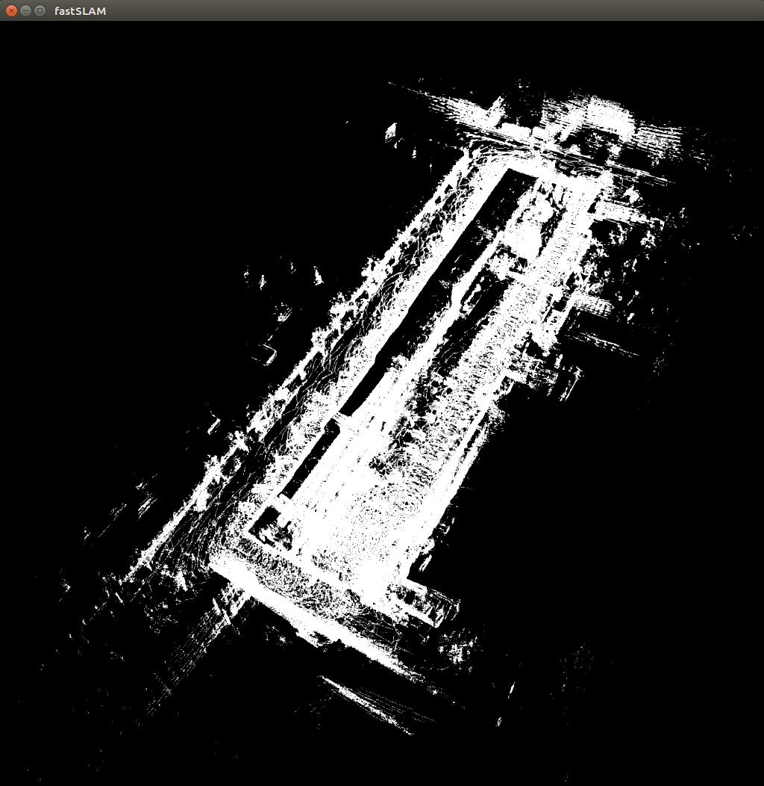
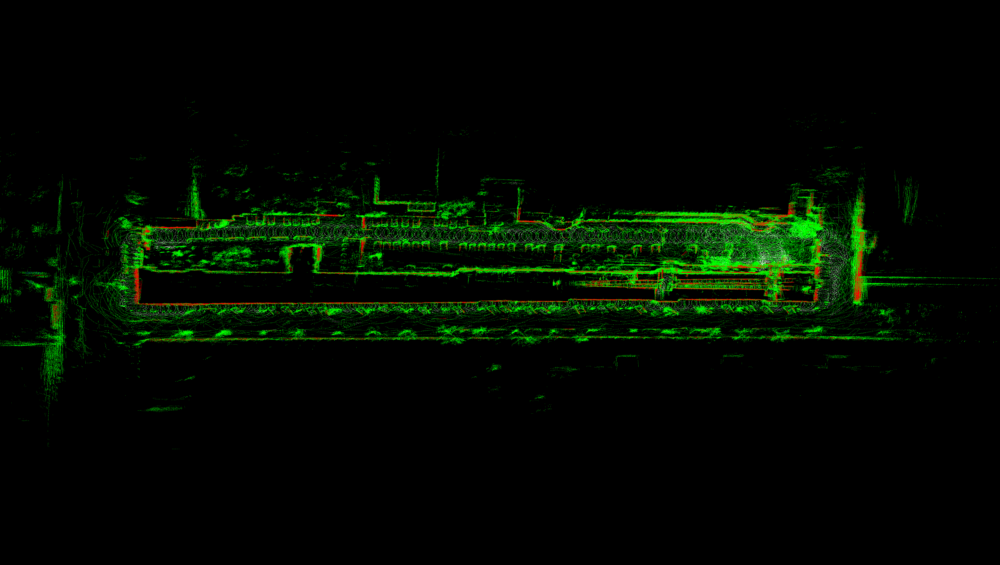
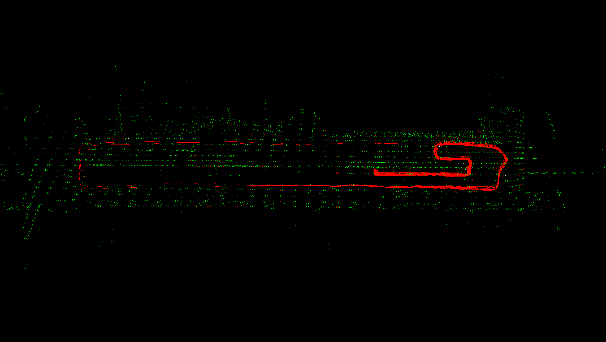
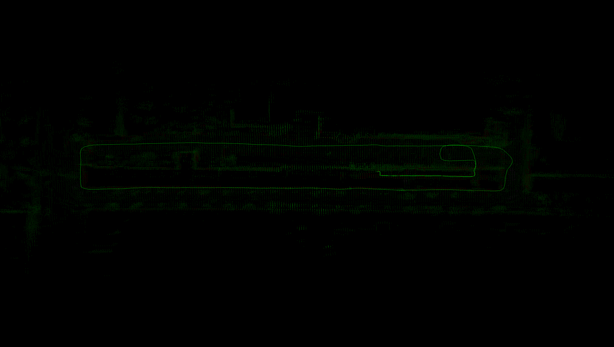
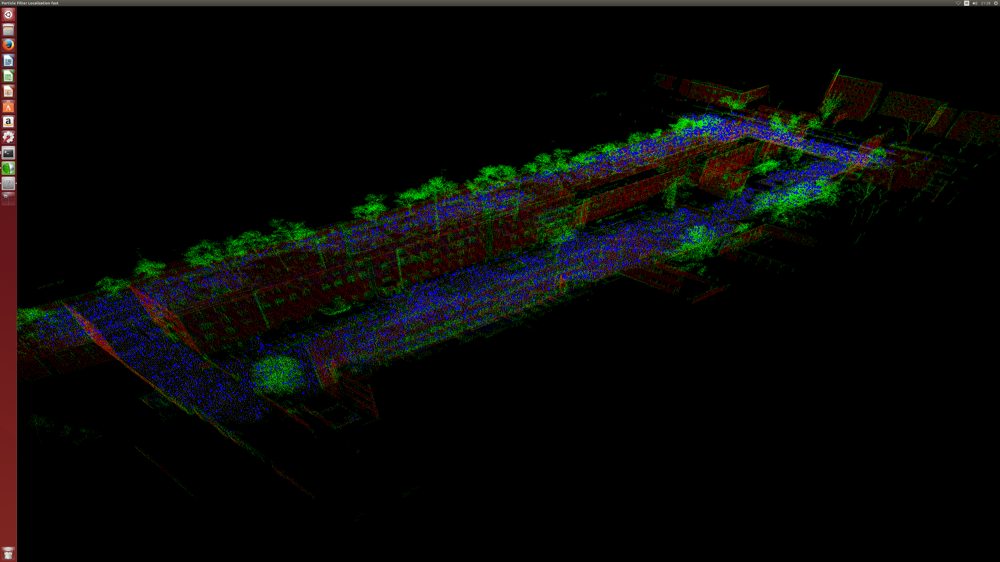
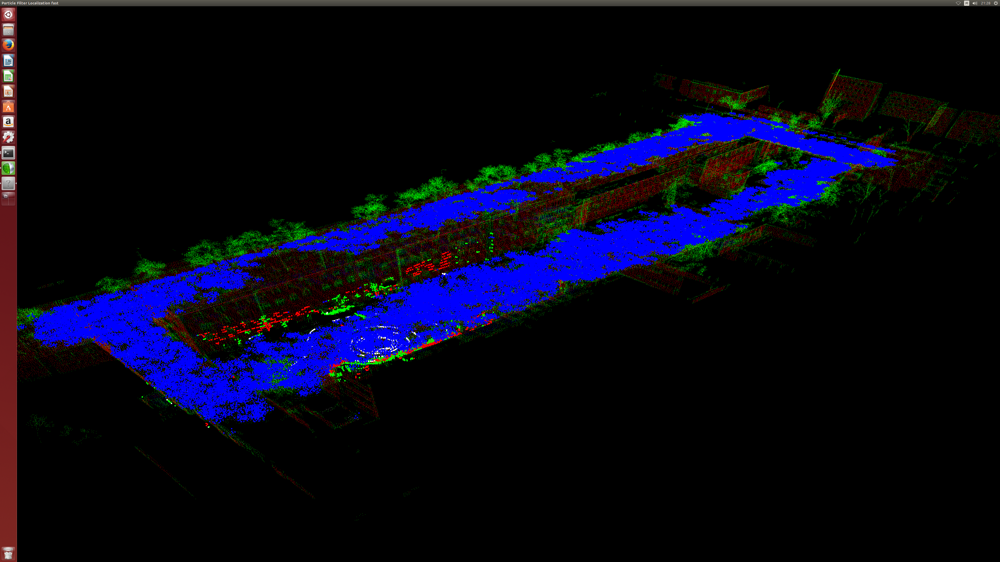
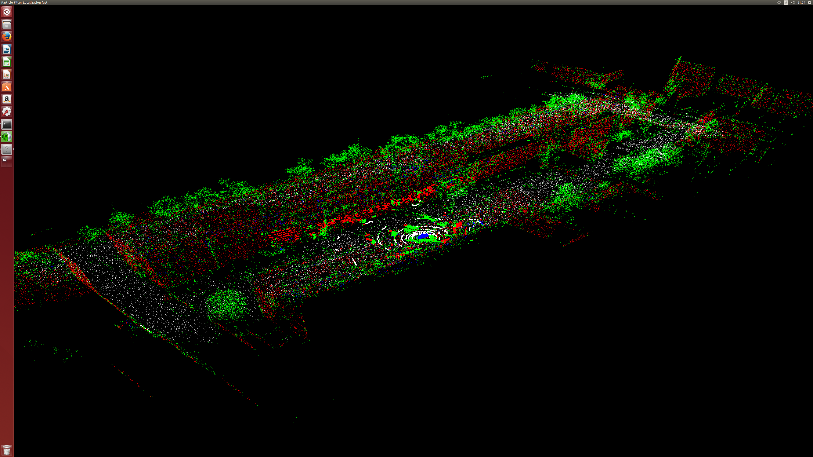

# GPU Computing in Robotics

This tutorial concerns robotic data processing with CUDA. 
Content of the tutorial:

## Lessons

### Lesson 0: basic transformations


### Lesson 1: down-sampling

### Lesson 2: noise removal (naive)

### Lesson 3: nearest neighborhood search

### Lesson 4: noise removal

### Lesson 5: normal vector computation

### Lesson 6: projections

### Lesson 7: basic semantics

### Lesson 8: semantic nearest neighborhood search

### Lesson 9: data registration Iterative Closest Point

### Lesson 10: data registration semantic Iterative Closest Point

### Lesson 11: data registration point to projection Iterative Closest Point

### Lesson 12: data registration Least Square Surface Matching (Ax=B solver on GPU)

### Lesson 13: data registration Plane To Plane (Ax=B solver on GPU)

### Lesson 14: multi scan registration Point To Point (Ax=B solver on GPU)

### Lesson 15: multi scan registration (LS3D Least Square Surface Matching, Ax=B solver on GPU)

### Lesson 16: multi scan registration semantic Point To Point (Ax=B solver on GPU)

### Lesson 17: path planning (via diffusion process)

### Lesson 18: image matching (BFROST: Binary Features from Robust Orientation Segment Tests)

### Lesson 19: laser range finder simulation

# Requirements

Software was developed and tested on LINUX UBUNTU 14.04, 16.04 with following libraries
OpenGL, GLUT, PCL 1.5, CUDA>=7.5

# Build
Each lesson is an independent software package, thus the following steps should be performed:
```
cd lesson_X
mkdir BUILD
cd BUILD
cmake -DCMAKE_BUILD_TYPE=Release ..
make
./lesson_X
```
## Use Cases

### fastSLAM
This DEMO shows the parallel computing for fastSLAM. Each particle containes 3D map built based on registered Velodyne VLP16 3D semantic data. The result is corrected trajectory.

#### Execute

Run `./fastSLAM` and read instructions in console


to run example
```
./fastSLAM ../dataset/model_reduced_pointXYZIRNL.xml
```
(check help in console, e.g. type c to start computations, software was tested on GF1050Ti, thus for this example the single scan calculation takes up to 40ms)

**Results**

Here are results achieved using example above.



Input semantic data


All trajectories (particles)


Best trajectory


### particle filter localization
This DEMO shows the use of GPU for robust robot localization based on 3D semantic data.

#### Execute

Run `./particle_filter_localization_fast` and read instructions in console

to run example

Run ./particle_filter_localization_fast ../dataset/metascan_pointXYZL.pcd ../dataset/odom_and_pointXYZL.xml

(check help in console, e.g. type i to start computations, software was tested on GF1050Ti, thus for this example the single particle filter calculation takes up to 50ms)

**Results**

Here are expected results.

Particle filter localization DEMO init state - 100000 particles.


Particle filter localization DEMO after first iteration.


Particle filter localization DEMO after some iterations.


Particle filter localization DEMO - 500 particles estimating current position.


### Robotic arm collision detection

